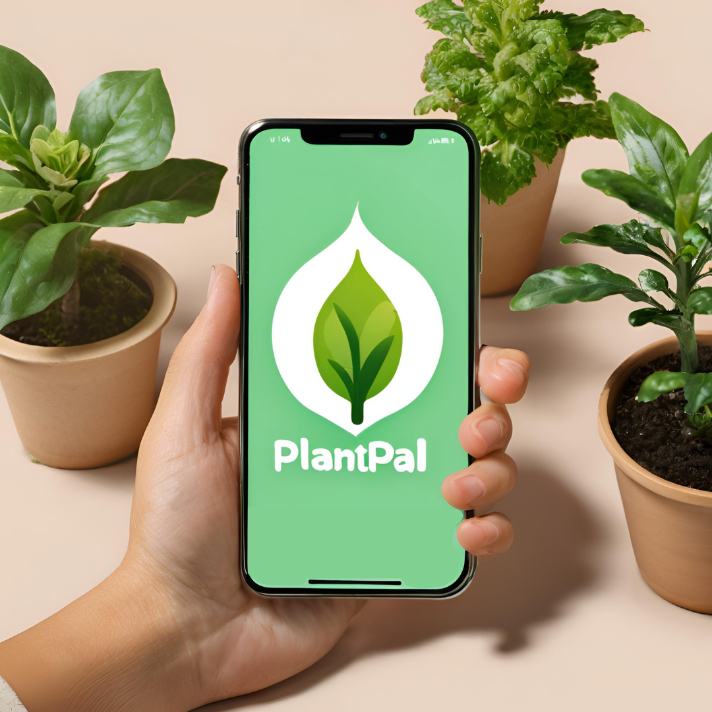

# Welcome to PlantPal 🪴 👋

<p align="center">

</p>

PlantPal is your ultimate companion for plant care, ensuring that your green friends are well taken care of even when you're away. Whether you're a frequent traveler, a busy professional, or just someone who loves plants, PlantPal makes plant care effortless by allowing you to create and share customized watering schedules for each of your plants.

## 🚀 Features

- **Personalized Plant Profiles**: Easily create profiles for your plants, complete with photos and detailed watering schedules.
- **Photo and Schedule Sharing**: Share plant care instructions with friends, family, or house sitters to ensure your plants are always in good hands.
- **Easy Import**: Quickly import collections of plants and their schedules to save time.
- **Flexible Photo Options**: Take a new photo or choose from your gallery when adding plants.
- **Simple User Interface**: A user-friendly interface that makes it easy to manage and delegate plant care.

## 🛠️ Get Started

1. **Install dependencies**

   ```bash
   npm install
   ```

2. **Start the app**

   ```bash
   npx expo start
   ```

   In the output, you'll find options to open the app in a:

   - [Development build](https://docs.expo.dev/develop/development-builds/introduction/)
   - [Android emulator](https://docs.expo.dev/workflow/android-studio-emulator/)
   - [iOS simulator](https://docs.expo.dev/workflow/ios-simulator/)
   - [Expo Go](https://expo.dev/go), a limited sandbox for trying out app development with Expo

You can start developing by editing the files inside the **app** directory. This project uses [file-based routing](https://docs.expo.dev/router/introduction).

## 🌟 Special Features

- **Flexible Photo Options**: Choose between taking a new photo or selecting one from your gallery when adding a plant.
- **Preview and Adjust**: Preview your photos before saving them, and make adjustments directly within the app.

With PlantPal, you can travel with peace of mind, knowing your plants are in safe hands!
